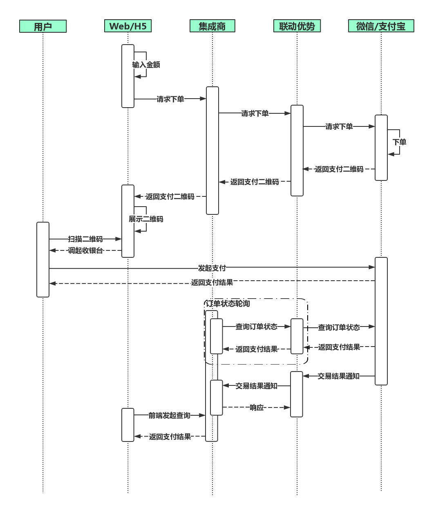

# 用户主扫

**简要描述：** 

- 商户->联动优势
- 商户通过下单接口获取指定支付方式的二维码并展示给消费者，消费者使用微信/支付宝/银联钱包等扫码完成支付
- 请通过主动调用**2.6订单状态同步**接口，配合**3.1交易结果通知**（异步回调）来保证订单状态一致性
- 交易时序图如下


**请求URL：** 
`https://mofunapi.umfintech.com/in-pay-client/api/activescan`

  
**请求方式：**
- POST 

**请求报文参数：** 

|	字段	|	名称	|	长度	|	必填	|	说明	|
|----|----|----|----|----|
|	partnerOrderId	|	商户订单号	|	32	|	M	|	商户的支付订单号	|
|	subMerId	|	商户号	|	8	|	M	|	商户号(联动平台分配)	|
|	amount	|	付款金额	|	13	|	M	|	是人民币，且以分为单位	|
|	payType	|	支付类型	|	2	|	M	|	WX：微信刷卡支付<br>AL：Alipay支付宝条码支付<br>YL：银联二维码支付	|
|	proxyId	|	集成商ID	|	4	|	M	|	集成商唯一标识（同魔方平台登录账号）	|
|	apiVersion	|	版本	|	3	|	M	|	定值:1.0	|
|	reqDate	|	请求日期	|	8	|	M	|	yyyyMMdd	|
|	reqTime	|	请求时间	|	6	|	M	|	HHmmss	|
|	sign	|	签名	|	256	|	M	|	参见签名机制	|
|	goodsInfo	|	商品信息	|	128	|	O	|	可上送商品描述、商户订单号等信息，用户付款成功后会在微信账单页面展示	|
|	shopNo	|	门店编号	|		|	O	|	门店编号	|
|	operator	|	收银员	|		|	O	|	收银员账号	|
|	expairTime	|	订单有效时间(秒)	|	600	|	O	|	当传递小于300秒或大于1800秒或不传递时系统默认为300秒<br>订单有效时间从调起用户密码键盘开始算起，超时之后,用户无法继续支付。	|
|	posSN	|	POSSN	|		|	O	|	POS唯一标识，可用于关联UPOS	|
|	notifyUrl	|	通知地址	|	256	|	O	| 	结果通知地址. 必须以 http:// 或 https:// 开始, 支持大小写字母,数字,'/','&','%','?','=' . 暂不支持通知地址中包含其他字符,包含url编码后的结果 如%3C %3E等	|


 **商户请求报文示例**

```json 
context={
	"amount": "99999",
	"subMerId": "30000102",
	"payType": "WX",
	"apiVersion": "1.0",
	"reqDate": "20180313",
	"partnerOrderId": "HSAPI1520909695265",
	"sign": "MMokEDpwU7vHy2AP2o4esBBLHRdsn3BorIdSHkbGpEOEAr9USwj++l9K8lyder2Yy/WmtEhyEL9xKiX4mS14ds7OKdzX6tGzy4qc2lsdRRSe5l9I9Gj7NdCLsq1TUccr2gnGibvu9UaAsCUCNmJqBrSW0YUl7+mVND9FFGecBe0=",
	"reqTime": "105455",
	"operator": "htcs2",
	"proxyId": "0049"
}
```

 **返回参数说明** 

|	字段	|	名称	|	长度	|	必填	|	说明	|
|----|----|----|----|----|
|	retCode	|	返回码	|	8	|	M	|	返回码	|
|	Memo	|	返回信息	|	128	|	M	|	返回信息	|
|	tradeNo	|	平台处理流水 	|		|	M	|	平台处理流水（对账及打印小票使用）	|
|	platDate	|	平台日期	|		|	M	|	平台日期（对账,退款及打印小票使用）	|
|	amount	|	付款金额	|	13	|	M	|	是人民币，且以分为单位	|
|	payType	|	支付类型	|		|	M	|	WX：微信刷卡支付<br>AL：Alipay支付宝条码支付<br>YL：银联二维码支付	|
|	feeUrl	|	缴费二维码地址	|		|	M	|	成功时返回内容，失败返回空字符串	|
|	partnerOrderId	|	商户订单号	|	32	|	O	|	支付订单号	|
|	sign	|	签名	|	256	|	M	|	参见签名机制	||
 **备注** 
- 更多返回错误代码请看[全局参数说明](单页面地址 : https://www.showdoc.cc/web/#/page/39370587223487 "全局参数说明")
